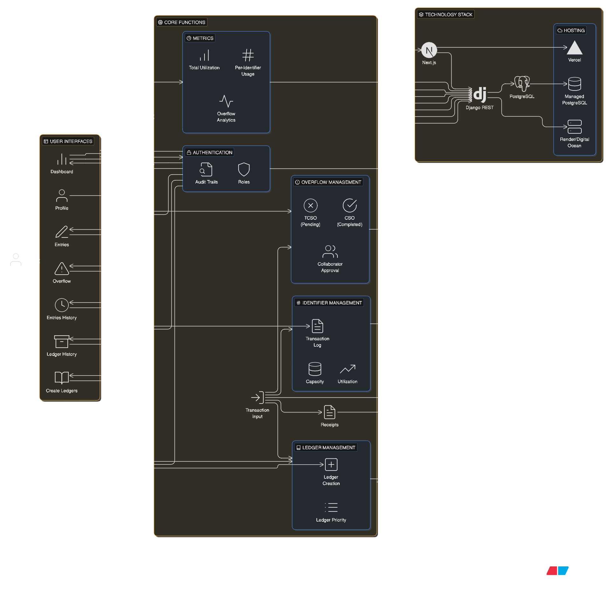

# Flowbit

**Capacity-Based Numeric Transaction Management System**

Flowbit is a web-based application designed to manage numeric identifiers (**000–999**) with strict capacity constraints. It enables precise transaction logging, multi-ledger allocation, overflow handling with approval workflows, and real-time monitoring through dashboards.

---

## 📌 Overview

Each numeric identifier represents an allocation space with a configurable capacity (default **100,000 units**). Users can log transactions, track utilization, manage overflows, and generate receipts while ensuring no invalid over-allocation occurs.

Flowbit is built for **accuracy, scalability, and production readiness**.

---

## 🧠 Key Features

### Ledger Management

- Create ledgers for defined periods
- Per-ledger capacity applied to all identifiers (000–999)
- Priority-based allocation across ledgers

### Numeric Identifier Management

- Identifiers: **000–999**
- Tracks:
  - Maximum capacity
  - Current utilization
  - Remaining capacity
  - Transaction history

### Transaction Input

- Simple format: `124 ← 3250`
- Automatic:
  - Validation
  - Timestamp
  - Transaction ID
  - Receipt number (e.g., `FB-000123`)
- Supports batch entry and multi-ledger allocation

### Overflow Management

- Automatic detection of capacity overflow
- States:
  - **TCSO** (Pending – red)
  - **CSO** (Approved – green)
- Collaborator-based approval workflow

### Dashboard & Analytics

- Total utilization
- Per-identifier usage
- Recent transactions
- Overflow analytics
- Period-based summaries

---

## 🖥️ User Interface

Side Drawer Menu:

1. Dashboard
2. Entries
3. Create Ledgers
4. Entries History
5. Ledger History
6. Overflow
7. Profile

---

## 🏗️ System Architecture



**Flow:**

1. User interacts with Next.js frontend
2. API requests sent to Django REST backend
3. Backend processes logic and updates PostgreSQL
4. Data returned to frontend in real time

---

## 🧩 Technology Stack

### Frontend

- **Next.js**
  - Server-side rendering
  - High performance
  - Scalable UI

### Backend

- **Django REST Framework**
  - Secure API development
  - ORM-based data handling
  - Admin interface

### Database

- **PostgreSQL**
  - Transactional integrity
  - Relational data modeling

### Hosting

- Frontend: **Vercel**
- Backend: **Render / Railway / DigitalOcean**
- Database: **Managed PostgreSQL**

---

## 🚀 Getting Started

### Prerequisites

- Node.js
- Python 3.10+
- PostgreSQL

### Frontend

```bash
cd frontend
npm install
npm run dev
```

### Backend

```bash
cd backend
pip install -r requirements.txt
python manage.py migrate
python manage.py runserver
```
